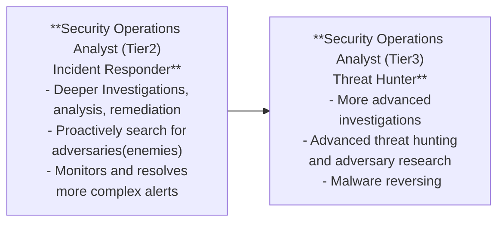

TryHackMe Room: https://tryhackme.com/room/jrsecanalystintrouxo

# Junior Security Analyst Role 🧑‍💻

- Triage specialist (They quickly decide who needs help first)
  
- Lots of time triaging/monitoring the event logs & alerts
  
**Tier 1 SOC 🛡️**
  
- Monitor and investigate the alerts
  
- Configure and manage the security tools
  
- Develop and implement basic IDS (Intrusion Detection System) signatures (Creating a list of attack patterns so they can be identified)
  
- Participate in SOC working groups, meetings
  
- Create tickets (digital report) and escalate the security incidents to the Tier 2 and Team Lead if needed
  
**Common Qualifications 🎓**
  
- 0-2 years of experience with Security Operations
  
- Basic Networking knowledge (OSI,TCP/IP Models, Operating systems, Web applications)
  
- Scripting/Programming skills +

- CompTIA Security+ is the desired certification

---
# Security Operations Center (SOC) 🏢

- Core function = Investigate, monitor, prevent, and respond to threats in the cyber realm 24/7.

- Trellix's definition: "Security Operations teams are charged with monitoring and protecting many assets. These include intellectual property, personnel data, business systems, and brand integrity".

- The # of people working in the SOC can vary depending on the organization's size.

*Preparation and Prevention 🧭*

- As a junior Security Analyst, you should be informed with the current cyber security threats. Crucial to detect and hunt threats, work on a security roadmap, and be ready for the worst-case scenario

- Prevention methods = gathering data on latest threats, threat actors, and their TTP (Tactics, Techniques, and Procedures".

  -Maintenance procedures (updating firewall signatures, patching, block-listing and safe-listing applications, email add, and IPs.

- To better understand TTP's, look into one of the CISA's alerts on APT10

*Monitoring and Investigation 🔍*

- SOC team proactively use SIEM (Security Information and Event Management) and EDR( Endpoint Detection Response) to monitor

- Levels of alerts (Low, medium, high, and critical). Properly configured security monitoring tools will help with determining this.

- Crucial role in investigation procedure. Perform triaging on the ongoing alerts by exploring and understanding how an attack works and prevent it from occuring.

  - Raise the question "How? When, and why?"... Security Analysts find the answers by drilling down on the data logs & alerts w/ open-source tools

*Response 🛠️*

- After the investigation, SOC teams will coordinate and take action on compromised hosts (isolating them from the network, terminating the malicious processes, deleting files, etc.)

*A Day in the Life of a Junior (Associate) Security Analyst 📆*

- The first thing almost all of them do is look at the tickets to see if any alerts got generated.

- Many open-source databased like AbuseIPDB, Cisco Talos Intelligence, where you can perform a reputation and location check for IP addresses. You can report them on AbuseIPDB.
