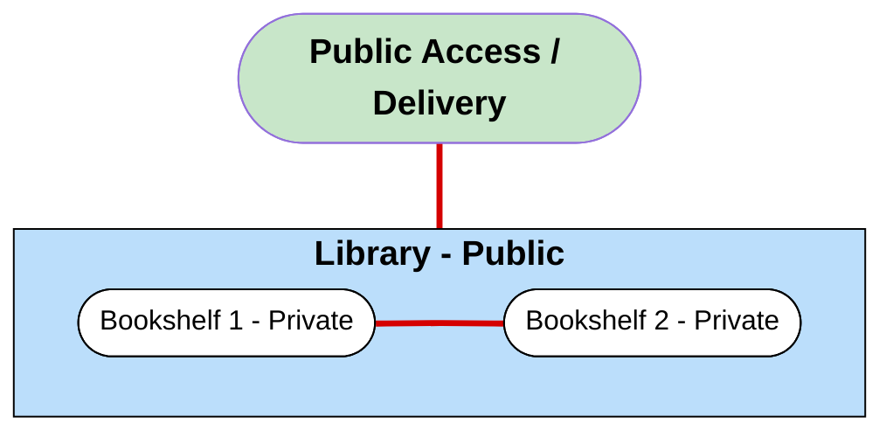

Source: TryHackMe Room Link: https://tryhackme.com/room/whatisnetworking

# "What Is Networking" Notes

**Networks in general = things that are connected**

-	Networking in computing = connected technological devices

-	Ex: You have a phone to access things (internet, email, cloud storage)

-	Networks are integrated into our everyday lives (gathering data for weather, delivering electricity, traffic lights and sensors, etc)

**What is the Internet? 🌐**

-	One giant network that has many small networks inside

    - Alice has a network, but more people join who only Alice can understand. Alice will act as the translator for the rest of the group (new network)

**First iteration of the internet was within the ARPANET project (1960s)**

-	Funded by the United States Defence Department

-	In 1989, Tim Berners-Lee created the World Wide Web (WWW, what we use today)

    -	This is when the internet started to be used as a repository for info

**The internet is made up of small networks, called private networks. Networks connecting these are called public networks.**

-	An analogy that works for me would be a library (Public Address) that everyone can see, but the bookshelves inside, where specific books are stored, aren't visible from the outside (private address).

**Image I made:**
 	

---
**Devices set labels to identify themselves on a network**

-	Devices must be identifying and identifiable on a network, so they use a set of labels

-	This is like Humans with their names and fingerprints

**Our name can change, but our fingerprints cannot**

-	Name = IP Address

-	MAC (Media Access Control) Address = Fingerprint
________________________________________

**Identifying Devices on a Network 💻📱**

**IP Addresses**

-	IP (Internet Protocol): Rules that devices use to communicate with each other through the internet (moves info around the internet)

-	Internet Protocol (IP) Address is a way of identifying a host (any device that connects ti a network) for a period of time (since they can change).

-	It's a set of numbers divided by 4 octets

-	Calculated through IP addressing and subnetting (explained in later discussion)

**They have a set of standards called protocols, which are the backbone of networking and force devices to speak the same language**

-	Since devices can be on a private and public network, this determines the type of IP Address they will have

-	When delivering books, the deliverer sees the public address (library) but not the specific shelves they go on.

-	Public Address (given to you by your ISP)/ Internet Service Provider) is used to identify a device on the Internet (what the world sees and uses to locates you online), a private address is used to identify specific devices **within your local network, like at your house.** 

    - Analogy: The library building is the Public Address. Other libraries can have "bookshelf 1" but if the same library has more than one shelf labeled "bookshelf 1", it would cause issues. (This applies to private IP addresses)

    - Another analogy: A hotel building is the Public Address. The rooms are the private addresses.

As more devices got connected to the internet, public addresses began to run out. They created a new iteration of IP called IPv6 which supports 2^128 IP addresses (340 trillion-plus). Previously it was IPv4, with 2^32 IP addresses (4.29 billion).

--- 

**MAC Addresses**

- Connected devices have a physical network interface card (NIC) on the motherboard that connects to the internet, and an identfier that is assigned at the factory is called the MAC Address (like a fingerprint)

    - It's a twelve character hexadecimal number (Hexadecimal is a way of counting that uses 16 symbols instead of 10: 0, 1, 2, 3, 4, 5, 6, 7, 8, 9, A, B, C, D, E, F. It's like having extra digits)

    -	The first half represents the company that made the hardware, the rest is unique.

**They can be faked/spoofed, since an attacker can pretend to be another device. This can be bad for firewalls and networks that only trust devices based off their MAC address (Like some cafes, hotels, airports) People can get access to premium access material the company provided to someone's MAC Address.

  - Analogy: The MAC Addresses would be the barcodes on each library book.

  - Analogy: A hotel building is the Public Address. The rooms are the private addresses. The people inside are MAC Addresses.

**Ping (ICMP) 📡**

-	Ping is a network tool (a command you can run) that uses ICMP (Internet Control Message Protocol) which checks if a connection between devices exists.

-	ICMP: It's like a messenger devices use to send error messages/operational information to each other, it's very important for Internet Protocol (IP).

-	Ping: A tool/ command that you can use that uses ICMP to check if another device is reachable on an IP network, and tells you how long that process took.

-	ICMP is the messenger/rules for the communication (like a technical language), Ping is the the tool

-	Command Example: ping google.com
________________________________________

# Sources

-	TryHackMe "What is Networking" Room Link: https://tryhackme.com/room/whatisnetworking

-	Internet Protocol Link: https://en.wikipedia.org/wiki/Internet_Protocol

-	Ping (networking utility) Link: https://en.wikipedia.org/wiki/Ping_(networking_utility)

-	Internet Control Message Protocol Link: https://en.wikipedia.org/wiki/Internet_Control_Message_Protocol

